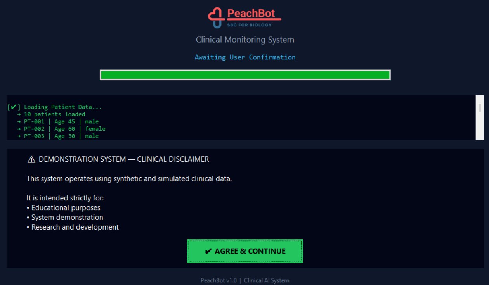
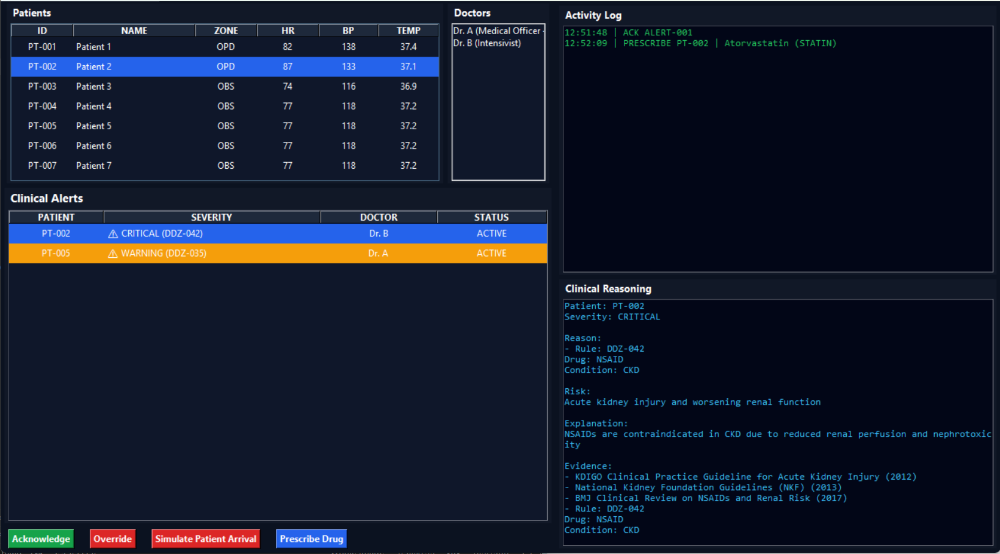
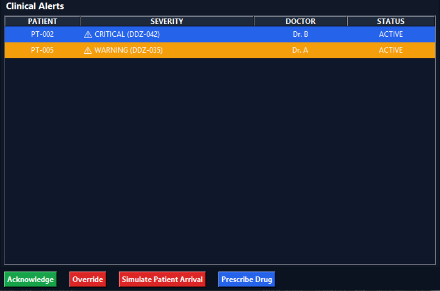
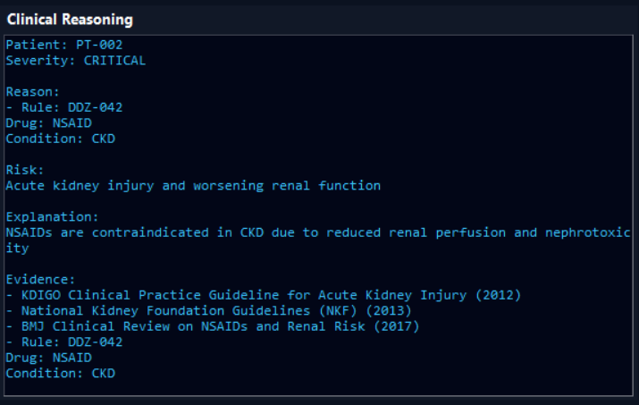
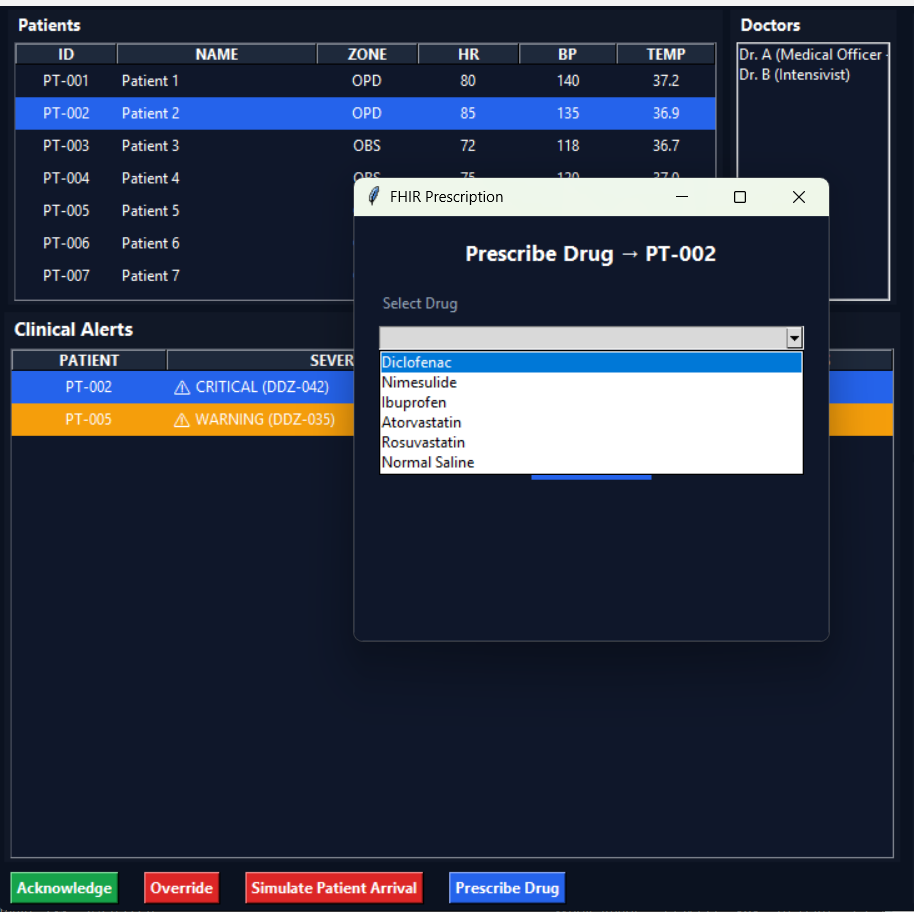

# PeachBot Medi (Demo)


[](https://doi.org/10.5281/zenodo.19939516)

### Edge-Native Clinical Intelligence Platform (Hybrid AI for Safety-Critical Systems)

> **PeachBot is building the infrastructure layer for real-time, explainable intelligence in healthcare.**
> This repository is a **working demo interface** of that system.

---

## One-Line Pitch

**PeachBot enables real-time, explainable clinical decision support at the edge — without relying on black-box AI or constant cloud connectivity.**

---

## What This Repo Is (and Isn’t)

***Is:** A **clinical monitoring demo** showcasing PeachBot’s intelligence layer
***Is Not:** The full platform (core engine, edge runtime, and knowledge systems are separate)

👉 Think of this as the **“front window” of a deeper system architecture**

---

## The Product

PeachBot is a **hybrid edge AI platform** designed for **safety-critical environments** like healthcare.

It combines:

* **Deterministic system orchestration (state-based control)**
* **AI models used in a constrained, supporting role**
* **On-device (edge) execution for real-time response**
* **Safety + audit layers for traceable outputs**

👉 Outcome: **Reliable, explainable, and deployable intelligence**

---

## Beachhead Use Case: Clinical Monitoring

This demo shows how PeachBot operates in a hospital-style setting:

### What You See in This Demo

* Real-time patient vitals monitoring
* Context-aware clinical alerts (not just thresholds)
* Explanation layer (why the alert happened)
* Prescription safety simulation
* Audit logs (traceability)
* Edge system boot sequence

---

## Product Preview

### System Boot



### Dashboard



### Alerts



### Reasoning Layer



### Prescription Module



---

## Demo Disclaimer

* Synthetic patient data
* No real hospital integration
* Not for clinical use

👉 Built to demonstrate **architecture + product direction**

---

## Why Now

Healthcare systems are facing:

* Increasing patient loads
* Need for continuous monitoring
* High cost of delayed intervention
* Lack of trust in opaque AI systems

At the same time:

* Edge computing is now viable
* AI models are powerful but **unreliable without constraints**

👉 The gap is not “more AI” — it’s **deployable, trustworthy AI systems**

---

## Our Approach 

Most AI healthcare tools today are:

* Cloud-first
* Model-centric
* Hard to audit

PeachBot is:

* **Edge-first** (runs where data is generated)
* **System-centric** (not just models)
* **Hybrid (deterministic + AI)**
* **Explainable by design**

👉 This is closer to a **clinical autopilot with human oversight**, not autonomous AI.

---

## Market Opportunity

### Total Addressable Market (TAM)

* Global **Digital Health Market**: ~$350B+
* **AI in Healthcare**: ~$200B+ (projected)
* **Clinical Decision Support Systems (CDSS)**: ~$10B–$15B+

---

### Serviceable Available Market (SAM)

Initial focus:

* Hospitals with digital monitoring systems
* ICU / step-down monitoring environments
* Remote patient monitoring programs

Estimated SAM: **$20B–$40B**

---

### Serviceable Obtainable Market (SOM)

Early-stage entry:

* Pilot deployments in:

  * Singapore
  * India
  * Select APAC healthcare systems

Initial wedge:
👉 **Edge-based clinical monitoring + decision support**

---

## Traction & Validation

* ✅ Functional MVP (this demo)
* ✅ Multi-layer architecture validated
* ✅ Edge-AI + clinical intelligence prototypes built
* ✅ Research + preprints in Edge AI / healthcare
* ✅ Patent filed (Edge-based clinical intelligence)

👉 Moving from **validated MVP → early deployment stage**

---

## Product Vision

PeachBot is not a single app.

It is a **platform for distributed intelligence systems**:

* Healthcare (current focus)
* Environmental intelligence
* Agriculture systems
* Biological intelligence modeling

---

## Roadmap

Near-term:

* EMR/EHR integration (FHIR)
* Clinical knowledge expansion
* Edge deployment pilots

Mid-term:

* Advanced predictive models (Edge-GNN)
* Multi-node hospital deployment
* Regulatory alignment pathways

Long-term:

* Distributed, federated intelligence networks
* Fully adaptive edge intelligence systems

---

## 🇸🇬 Singapore Entry Pass Narrative (Aligned Positioning)

PeachBot aligns strongly with Singapore’s focus on:

* **AI-driven healthcare innovation**
* **Digital health infrastructure**
* **Trustworthy & explainable AI systems**

The platform contributes to:

* Safer clinical workflows
* Real-time healthcare intelligence
* Scalable, edge-based infrastructure

👉 Positioned as a **deep-tech, healthcare AI infrastructure startup**, not a generic app.

---

## Run the Demo

```bash id="g4sybp"
python main.py
```

---

## What We’re Looking For

* Clinical pilot partners
* Research collaborations
* Strategic healthcare deployments
* Early-stage investors aligned with deep-tech + healthcare

---
## Citation

If you use PeachBot in research or reference this work:

```bibtex
@software{peachbot2026,
  author = {Swapin Vidya},
  title = {PeachBot Clinical Monitoring Demo},
  year = {2026},
  url = {https://github.com/peachbotAI/peachbot-demo}
}
```


---
## ⚠️ Medical Disclaimer

Please review the full medical disclaimer before using this system:

👉 [Medical Disclaimer](MEDICAL_DISCLAIMER.md)


## Contact

**PeachBot Research & Innovations**
Singapore · India

[info@peachbot.in](mailto:info@peachbot.in)

---

## Closing

> Most AI systems are built for demos.
> PeachBot is being built for **deployment in the real world**.

This repository is a **small, visible layer** of that system.

## Version

**Current Version:** v0.1.0

### Release Notes

**v0.1.0 — Initial Demo Release**
- Real-time patient monitoring dashboard
- Clinical alert system (Critical / Warning)
- Explainable reasoning panel
- Prescription simulation module
- Audit logging
- Boot sequence UI

> This release represents the first public demo of the PeachBot clinical intelligence interface.

